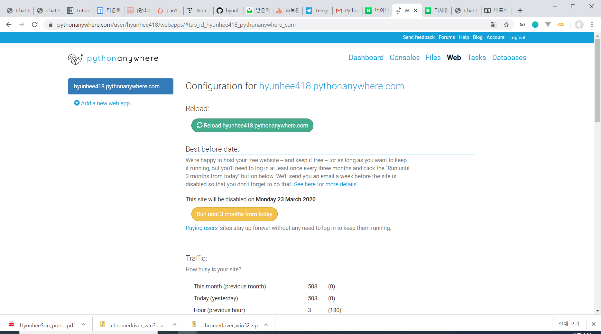

# Chatbot

### 1. 목표

	i. Flask framework 사용해보기

	ii. 네이버 API를 이용하여 '/번역 <keyword>'를 입력하면 keyword를 번역요청 후 번역된 		메세지를 user에게 보내기


### 2. 핵심 기능

- NaverAPI key를 받아 .env에 숨김 저장

- config를 통해 .env에 있는 key를 불러오고 requests로 요청보내기

- 미세먼지를 물어보면 네이버에서 크롤링하여 가져오기

  app.py

```python
from flask import Flask, render_template, request
import requests
from decouple import config
import bs4

app = Flask(__name__)

api_url = 'https://api.telegram.org'
token = config('TOKEN')
admin_id = config('ADMIN_ID')
secret_url = config('SECRET_URL')
naver_client_id = config('NAVER_CLIENT_ID')
naver_client_secret = config('NAVER_CLIENT_SECRET')

commands = [
    '/번역 <키워드>',
    '/미세먼지',
]

@app.route('/')
def index():
    return ':)'

@app.route('/chatbot', methods=['POST'])
def telegram():
    req = request.get_json()
    user = req['message']['from']['id']  # user의 chat id
    message = req['message']['text']  # user의 입력 메세지
    no_error = '존재하지 않는 명령어입니다.'

    if message[0] == '/':
        if ' ' in message:  # 띄어쓰기 후에 추가 input 있음
            words = message.split(' ')  # '/번역 댕댕이' 문자열이 ['/번역', '댕댕이'] 리스트로 바뀜
            if words[0] == '/번역':
                headers = {
                    'X-Naver-Client-Id': naver_client_id,
                    'X-Naver-Client-Secret': naver_client_secret,
                }

                data = {
                    'source': 'ko',
                    'target': 'en',
                    'text': words[1],
                }

                res = requests.post('https://openapi.naver.com/v1/papago/n2mt', data=data, headers=headers)
                result = res.json()['message']['result']['translatedText']  # 번역결과
            else:
                result = no_error
        else:  # 띄어쓰기 없음
            if message == '/미세먼지':
                url = 'https://search.naver.com/search.naver?sm=top_hty&fbm=0&ie=utf8&query=%EB%AF%B8%EC%84%B8%EB%A8%BC%EC%A7%80'
                response = requests.get(url).text
                #url에서 data 가져오기
                text = bs4.BeautifulSoup(response, 'html.parser')
                #Python에서 select_one을 쓸 수 있게 하는 함수, data를 예쁘게 만들어서 알아볼 수 있게 함.
                # print(text)
                dust = text.select_one('#main_pack > div.content_search.section._atmospheric_environment > div > div.contents03_sub > div > div > div.main_box > div.detail_box > div.tb_scroll > table > tbody').text.replace('   ', ', ')
                # t1 = dust.select_one('span.lv2').text


                #데이터에서 필요한 정보만 추출
                print(dust)
                # print(t1)

            else:
                result = no_error
    else:
        result = str(commands)

    URL = f'{api_url}/bot{token}/sendMessage?chat_id={user}&text={result} :)'
    requests.get(URL)
    return ('success', 200)

if __name__ == '__main__':
    app.run(debug=True, port=80)
```


### 3. 배포

##### PythonAnywhere을 사용하여 배포하기

* PythonAnywhere 가입하여 블로그 만들기

* 필요 파일 만들기

* Web에 new app 만들기

* 수정 시 Files에서 수정 후 반드시 Reload !

  


### 4. 사이트 세부 기능과 이미지


### 5. 프로젝트를 마치며

Flask라는 framework에서 NaverAPI를 이용하여 데이터를 제공하는 Telegram bot을 만들었다. Chatbot을 만드는 것이 큰 프로젝트라 생각했는데 telegram에서 제공된 것을 사용하니 더 편리하게 이용할 수 있었다. 

NaverAPI와 Telegram bot을 활용하여 chatbot을 구현해보니 직접 구현하는 것도 중요하지만 웹에서 제공서비스가 다양하기 때문에 이를 이용할 줄 아는 것 또한 중요하다는 것을 깨달았다.

앞으로의 프로젝트에 있어 API를 이용하는 것이 많이 사용될 것 같다.
